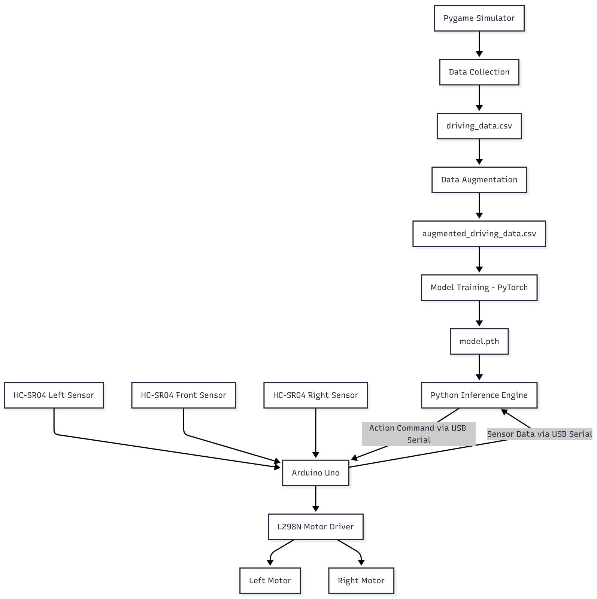

# 🏎️ Neural-Drive: Autonomous Obstacle Avoidance Car
> **An autonomous robotic vehicle using Imitation Learning (Behavioral Cloning) to navigate complex environments.**

 
*(Replace the above with a GIF of your car driving!)*

---

## 🌟 Overview
Neural-Drive is a deep-learning-based autonomous vehicle that bridges high-level Python neural inference with low-level C++ embedded control. The car learns to navigate by observing human behavior and mapping ultrasonic sensor data to discrete driving primitives.

## 🏗️ System Architecture
The system follows a distributed architecture where the Arduino handles real-time sensing and motor control, while a Python-based AI engine handles the "brain" functions.



### Key Components:
- **Sensing:** 3x HC-SR04 Ultrasonic Sensors providing a 180° field of view.
- **Micro-Inference:** Python-to-Arduino serial bridge running at 115,200 baud.
- **DSP:** Real-time Median Filtering to eliminate sonic noise and SPECULAR reflection.
- **Safety:** Asynchronous motor ramping to prevent voltage sags and MCU brownouts.

---

## 🧠 Neural Network Architecture
The car's decision-making is powered by a Deep Multi-Layer Perceptron (MLP).


### Specifications:
- **Input Layer:** 3 Nodes (Normalized Front, Left, Right distances).
- **Hidden Layers:** 2x 64 Neurons with **ReLU Activation**.
- **Regularization:** Dropout (0.1) to prevent overfitting during training.
- **Output Layer:** 6 Nodes representing discrete driving actions (Forward, Turn Left/Right, Reverse, etc.).

---

## 🛠️ Tech Stack
- **AI Framework:** PyTorch
- **Embedded:** C++ (Arduino Firmware)
- **Data Science:** Pandas, NumPy, Scikit-Learn
- **Communication:** PySerial (UART)

---

## 🚀 Getting Started

### 1. Hardware Setup
Connect your Arduino, L298N Motor Driver, and HC-SR04 sensors. 
- **Arduino Pins:** Defined in `firmware.ino`.
- **Power:** 7.4V - 12V Li-ion battery recommended for motors.

### 2. Physical Firmware
Upload the `firmware.ino` code to your Arduino Uno/Nano using the Arduino IDE.

### 3. Installation
```bash
# Clone the repository
git clone https://github.com/your-username/neural-drive.git
cd neural-drive

# Install dependencies
pip install -r requirements.txt
```

### 4. Running the Car
Ensure the Arduino is connected via USB, then run the hardware driver:
```bash
python drive_hardware.py
```

---

## 📂 Repository Structure
- `firmware.ino`: Non-blocking C++ code for sensor polling and motor PWM ramping.
- `drive_hardware.py`: The main AI bridge. Handles inference and sensor de-noising.
- `train_model.py`: PyTorch training script for the neural network.
- `model.pth`: The pre-trained weights for the driving model.
- `simulator.py`: (Optional) 2D simulator for data collection and testing.

---

## 📝 License
This project is licensed under the MIT License.

**Developed with ❤️ by Nidharshanaa**
